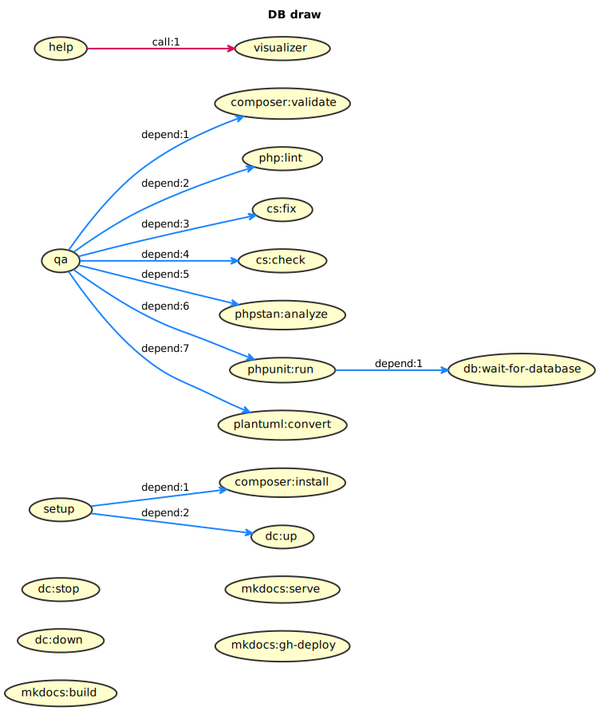

# Dev notes

## Phing targets



## Running tests

PHPUnit needs a mysql database to run tests, this is handled by `docker compose`:

```console
phing setup remote:qa
```

Running tests locally:

```console
phing qa -Ddb.host=172.23.0.2
```

PHPUnit without Phing:

```console
DB_HOST=172.23.0.2 vendor/bin/phpunit tests/DiagramTest.php testTheme
```
