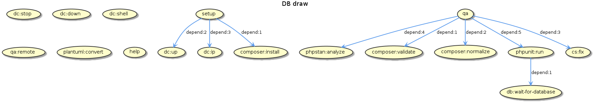

# Dev notes

## Phing targets



## Running tests

PHPUnit needs a mysql database to run tests.

This is handled by `docker-composer`, nevertheless you can customize this host:

```console
phing phpunit:run -Ddb.host=172.25.0.2
```
