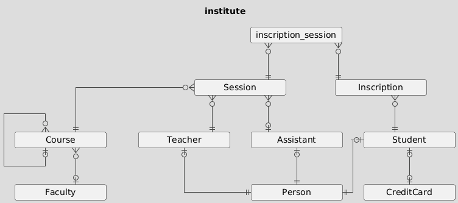
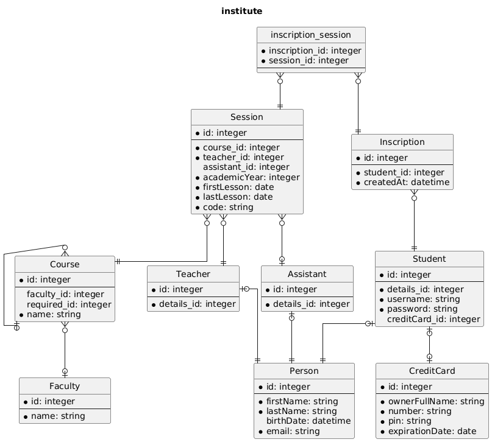

# Diagram sizes

## Mini

Mini diagrams are composed by table names only.

```php
$dbDraw = new DbDraw($connection);
$mini   = $dbDraw->generatePuml(DbDraw::MINI);
```



## Midi

Midi diagrams displays columns names and type.

```php
$dbDraw = new DbDraw($connection);
$midi   = $dbDraw->generatePuml(DbDraw::MIDI);
```



## Maxi

Same as Midi, but Views are also displayed.

```php
$dbDraw = new DbDraw($connection);
$maxi   = $dbDraw->generatePuml(DbDraw::MAXI);
```


