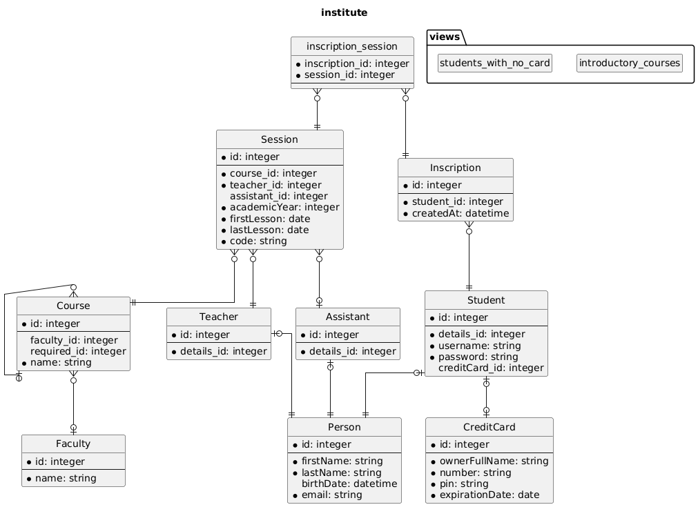

# Diagram sizes

## Mini

```php
$dbDraw = new DbDraw($connection);
$mini   = $dbDraw->generatePuml(DbDraw::MINI); // only table names
```


## Midi

```php
$dbDraw = new DbDraw($connection);
$midi   = $dbDraw->generatePuml(DbDraw::MIDI); // like mini with columns
```


## Maxi

```php
$dbDraw = new DbDraw($connection);
$maxi   = $dbDraw->generatePuml(DbDraw::MAXI); // like midi with views
```


