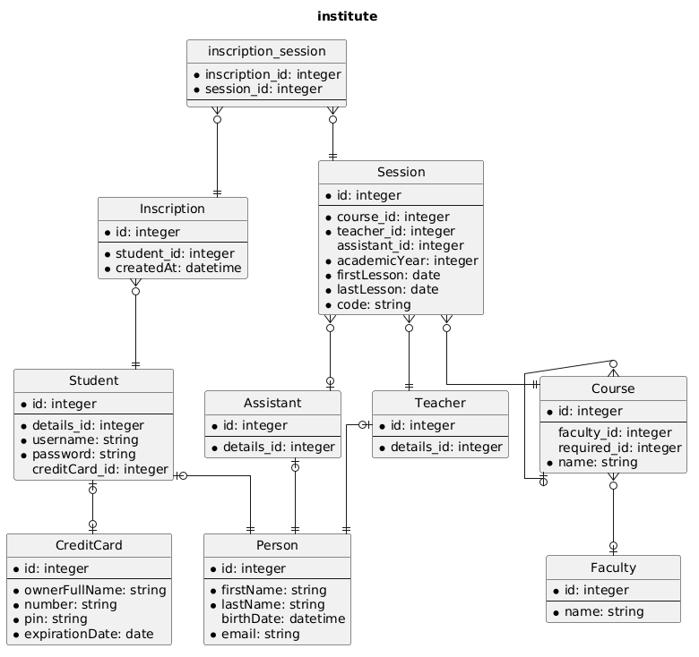

**`DbDraw` is a PHP library that generates Entity–Relationship (ER) diagrams
from existing databases. It takes a DoctrineORM connection as input and produces
a diagram as output.**

**DbDraw supports multiple diagram sizes and themes, making it easy to visualize
and document your database structure.**

**⚠️ It is primarily intended to be consumed as a dependency by the
[jawira/doctrine-diagram-bundle](https://github.com/jawira/doctrine-diagram-bundle)
project.**



## Installing

```console
composer require jawira/db-draw
```

## How to use

Because **DB Draw** is a library, you have to use it as a dependency and
instantiate it in your project.

In order to create a diagram you have to follow these steps:

1. Your application must provide a
   valid [doctrine/dbal](https://github.com/doctrine/dbal) connection.
2. Instantiate `\Jawira\DbDraw\DbDraw` using your _dbal connection_.
3. Call `DbDraw::generatePuml` using a diagram size (`Size::Mini`, `Size::Midi`,
   `Size::Maxi`), and a theme.
4. Then `DbDraw::generatePuml` will return
   a [PlantUML diagram](https://plantuml.com/ie-diagram).
5. Is up to you to convert the _puml_ diagram to another image format (e.g.
   _png_ or _svg_). I suggest to
   use [jawira/plantuml-client](https://github.com/jawira/plantuml-client).

Example:

```php
use Doctrine\DBAL\DriverManager;
use Jawira\DbDraw\DbDraw;
use Jawira\PlantUmlClient\{Client, Format};
use Jawira\DoctrineDiagramContracts\Size;

// a. Some logic to retrieve $connection (\Doctrine\DBAL\Connection)
$connectionParams = [
      'user' => 'groot',
      'password' => 'groot',
      'host' => '127.0.0.1',
      'port' => 33060,
      'dbname' => 'institute',
      'charset' => 'utf8mb4',
      'driver' => 'pdo_mysql',
      'serverVersion' => '8.2',
    ];
$connection = DriverManager::getConnection($connectionParams);
$connection->getDatabasePlatform()->registerDoctrineTypeMapping('enum', 'string'); // optional

// b. Using jawira/db-draw: generating PlantUML diagram
$dbDiagram = new DbDraw($connection);
$puml      = $dbDiagram->generatePuml(Size::MIDI, 'plain', [],[]); // set size and theme here
file_put_contents('database.puml', $puml);

// c. (Optional) Converting & saving png image (using jawira/plantuml-client)
$client = new Client();
$png    = $client->generateImage($puml, Format::PNG);
file_put_contents('database.png', $png);
```

## Repository

https://github.com/jawira/db-draw
