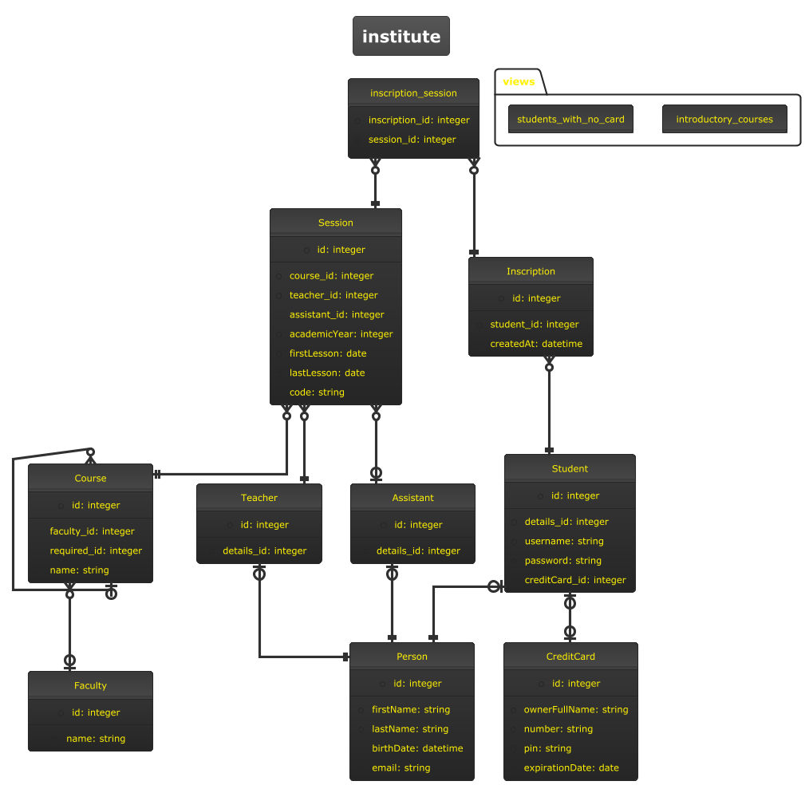
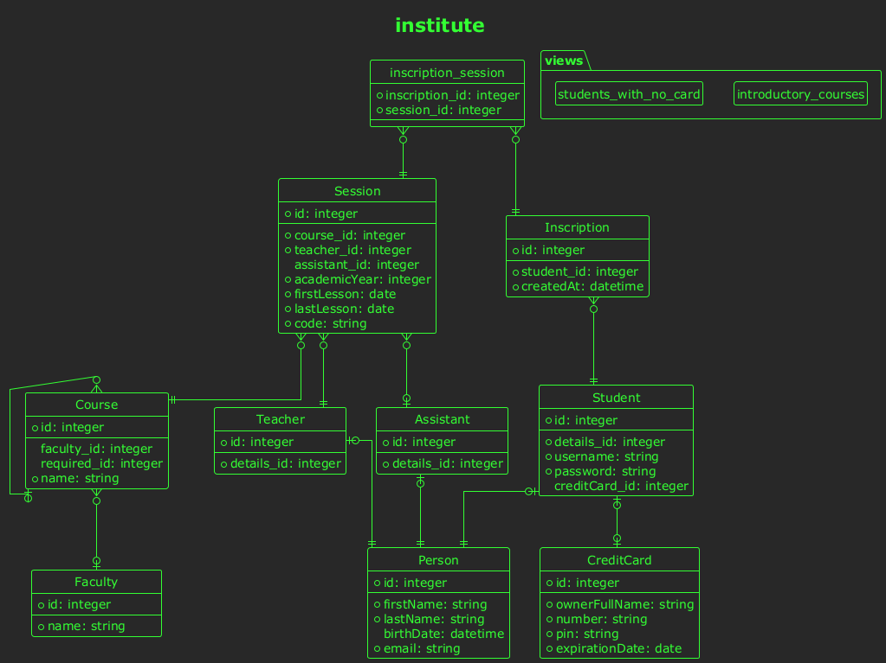
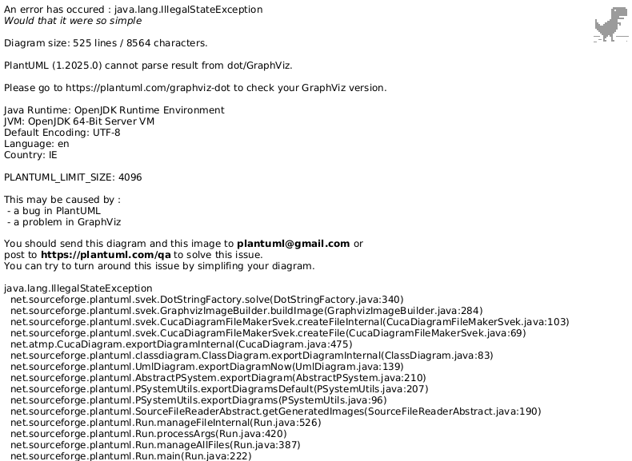
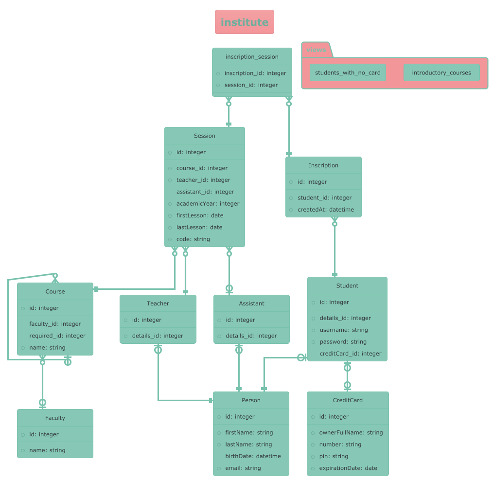
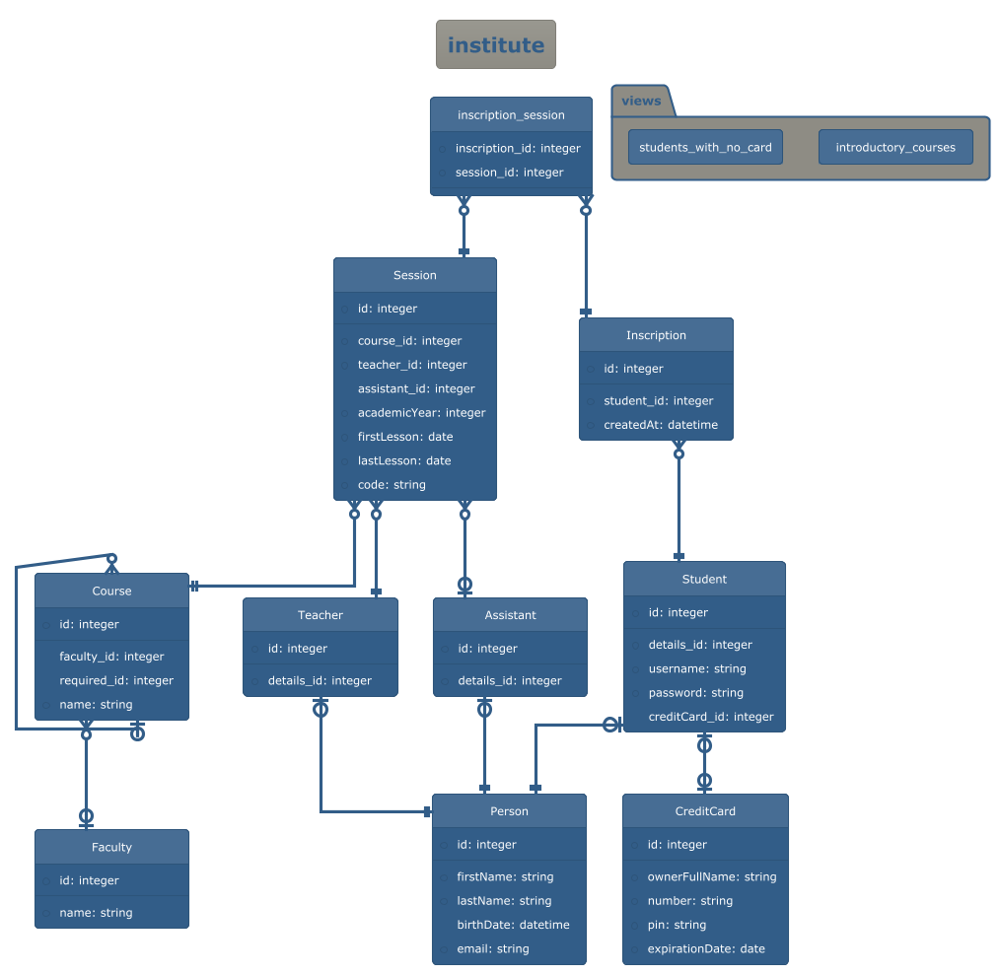
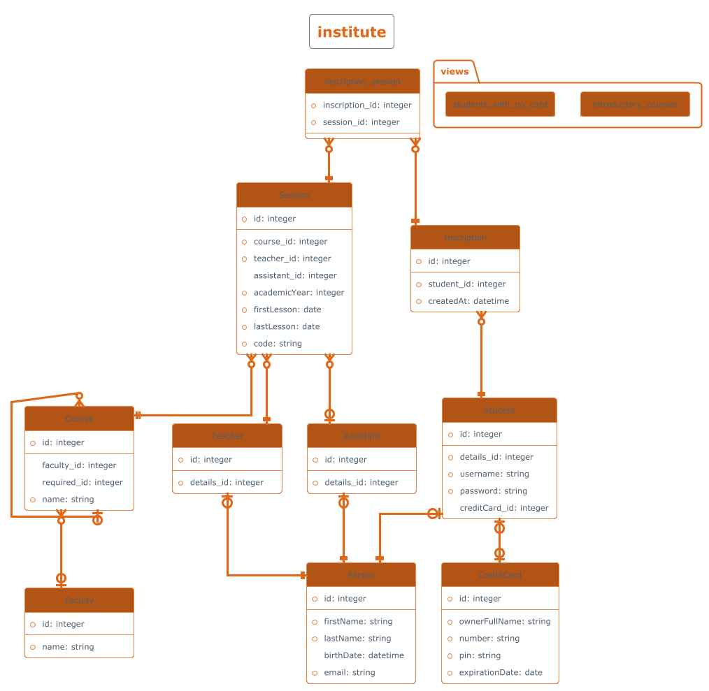
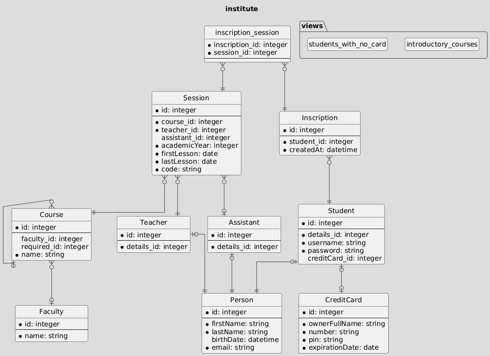

# Themes

## amiga

```php
use Jawira\DbDraw\{DbDraw, Theme};
$puml = $dbDiagram->generatePuml(DbDraw::MINI, Theme::AMIGA);
```


## black-knight

```php
use Jawira\DbDraw\{DbDraw, Theme};
$puml = $dbDiagram->generatePuml(DbDraw::MINI, Theme::BLACK_KNIGHT);
```



## bluegray

```php
use Jawira\DbDraw\{DbDraw, Theme};
$puml = $dbDiagram->generatePuml(DbDraw::MINI, Theme::BLUEGRAY);
```


## blueprint

```php
use Jawira\DbDraw\{DbDraw, Theme};
$puml = $dbDiagram->generatePuml(DbDraw::MINI, Theme::BLUEPRINT);
```


## cerulean

```php
use Jawira\DbDraw\{DbDraw, Theme};
$puml = $dbDiagram->generatePuml(DbDraw::MINI, Theme::CERULEAN);
```


## cerulean-outline

```php
use Jawira\DbDraw\{DbDraw, Theme};
$puml = $dbDiagram->generatePuml(DbDraw::MINI, Theme::CERULEAN_OUTLINE);
```


## crt-amber

```php
use Jawira\DbDraw\{DbDraw, Theme};
$puml = $dbDiagram->generatePuml(DbDraw::MINI, Theme::CRT_AMBER);
```


## crt-green

```php
use Jawira\DbDraw\{DbDraw, Theme};
$puml = $dbDiagram->generatePuml(DbDraw::MINI, Theme::CRT_GREEN);
```



## cyborg

```php
use Jawira\DbDraw\{DbDraw, Theme};
$puml = $dbDiagram->generatePuml(DbDraw::MINI, Theme::CYBORG);
```


## cyborg-outline

```php
use Jawira\DbDraw\{DbDraw, Theme};
$puml = $dbDiagram->generatePuml(DbDraw::MINI, Theme::CYBORG_OUTLINE);
```


## hacker

```php
use Jawira\DbDraw\{DbDraw, Theme};
$puml = $dbDiagram->generatePuml(DbDraw::MINI, Theme::HACKER);
```


## lightgray

```php
use Jawira\DbDraw\{DbDraw, Theme};
$puml = $dbDiagram->generatePuml(DbDraw::MINI, Theme::LIGHTGRAY);
```


## materia

```php
use Jawira\DbDraw\{DbDraw, Theme};
$puml = $dbDiagram->generatePuml(DbDraw::MINI, Theme::MATERIA);
```


## materia-outline

```php
use Jawira\DbDraw\{DbDraw, Theme};
$puml = $dbDiagram->generatePuml(DbDraw::MINI, Theme::MATERIA_OUTLINE);
```



## metal

```php
use Jawira\DbDraw\{DbDraw, Theme};
$puml = $dbDiagram->generatePuml(DbDraw::MINI, Theme::METAL);
```


## mimeograph

```php
use Jawira\DbDraw\{DbDraw, Theme};
$puml = $dbDiagram->generatePuml(DbDraw::MINI, Theme::MIMEOGRAPH);
```


## minty

```php
use Jawira\DbDraw\{DbDraw, Theme};
$puml = $dbDiagram->generatePuml(DbDraw::MINI, Theme::MINTY);
```



## plain

```php
use Jawira\DbDraw\{DbDraw, Theme};
$puml = $dbDiagram->generatePuml(DbDraw::MINI, Theme::PLAIN);
```


## resume-light

```php
use Jawira\DbDraw\{DbDraw, Theme};
$puml = $dbDiagram->generatePuml(DbDraw::MINI, Theme::RESUME_LIGHT);
```


## sandstone

```php
use Jawira\DbDraw\{DbDraw, Theme};
$puml = $dbDiagram->generatePuml(DbDraw::MINI, Theme::SANDSTONE);
```



## silver

```php
use Jawira\DbDraw\{DbDraw, Theme};
$puml = $dbDiagram->generatePuml(DbDraw::MINI, Theme::SILVER);
```


## sketchy

```php
use Jawira\DbDraw\{DbDraw, Theme};
$puml = $dbDiagram->generatePuml(DbDraw::MINI, Theme::SKETCHY);
```


## sketchy-outline

```php
use Jawira\DbDraw\{DbDraw, Theme};
$puml = $dbDiagram->generatePuml(DbDraw::MINI, Theme::SKETCHY_OUTLINE);
```


## spacelab

```php
use Jawira\DbDraw\{DbDraw, Theme};
$puml = $dbDiagram->generatePuml(DbDraw::MINI, Theme::SPACELAB);
```


## superhero

```php
use Jawira\DbDraw\{DbDraw, Theme};
$puml = $dbDiagram->generatePuml(DbDraw::MINI, Theme::SUPERHERO);
```


## superhero-outline

```php
use Jawira\DbDraw\{DbDraw, Theme};
$puml = $dbDiagram->generatePuml(DbDraw::MINI, Theme::SUPERHERO_OUTLINE);
```



## toy

```php
use Jawira\DbDraw\{DbDraw, Theme};
$puml = $dbDiagram->generatePuml(DbDraw::MINI, Theme::TOY);
```



## united

```php
use Jawira\DbDraw\{DbDraw, Theme};
$puml = $dbDiagram->generatePuml(DbDraw::MINI, Theme::UNITED);
```


## vibrant

```php
use Jawira\DbDraw\{DbDraw, Theme};
$puml = $dbDiagram->generatePuml(DbDraw::MINI, Theme::VIBRANT);
```


